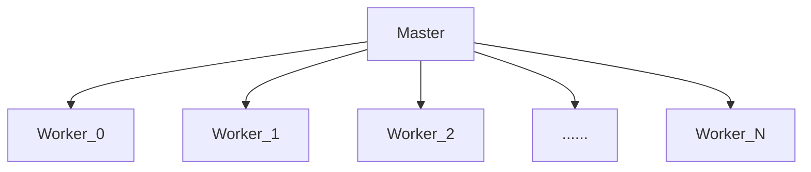
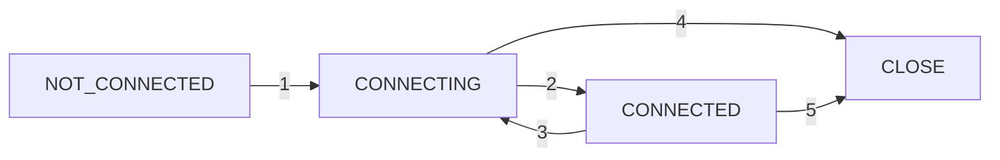

# zookeeper读书笔记

## zookeeperde的使命

* 它可以在分布式系统中协作多个任务。
* 一个协作任务是指一个包含多个进程的任务
* 这个任务可以是为了协作或者是为了管理竞争。
* 协作意味着多个进程需要一同处理某些事情，一些进程采取某些行动使得其他进程可以继续工作。比如典型的主—从（master-worker）工作模式，从节点处于空闲状态时会通知主节点可以接受工作。于是主节点会分配任务给从节点。
* 竞争则不同。它是指两个进程不能同时处理工作的情况。一个进程必须等待另一个进程。

## zookeeper不适用的场景

​	整个Zookeeper的服务器集群管理着应用协作的关键数据。不适合用作海量数据存储。

## zookeeper构建分布式系统

分布式系统定义：分布式系统是同时跨越多个物理主机，独立运行的多个软件组件组成的系统。

分布式系统中的进程通信有两种选择：

* 直接通过网络进行信息交换
* 读写某些共享存储

ZooKeeper使用工程存储模型来实现应用间的协作和同步原语。对于共享存储本身，又需要进行和存储间进行网络通信。

网络通信很重要，因为它是分布式系统中并发设计的基础。

在真实的系统中，我们需要注意如下问题：

* 消息延迟
* 处理器性能
* 时钟偏移

## 示例：主—从应用

### 主从结构示意图

​	一般在这种架构中，主节点进程负责跟踪从节点的状态和任务的有效性，并分配任务到从节点。

​	对于Zookeeper来说，这个架构具有代表性，阐述了大多数流行的任务，如：选举主节点，跟踪有效的从节点，维护应用元数据。

### 关键问题	

​	要实现主—从模式的系统，我们必须解决如下三个关键问题：

* 主节点崩溃

  如果主节点发送错误并失效，系统将无法分配新的任务和重新分配以失败的任务

* 从节点崩溃

  如果从节点崩溃，已分配的任务将无法完成

* 通信故障

  如果主节点和从节点无法进行信息交换，从节点将无法得知新任务分配给它

  ​	为了处理这些问题，之前的主节点出现问题时，系统需要可靠地选举一个新的主节点，判断哪些从节点有效并判定一个从节点的状态对于西戎其他的部分是否失效。

### 主节点失效

当主节点失效时，我们需要一个备用主节点。

1、，主节点崩溃时，状态恢复问题

* 当主节点崩溃时，备份主节点接管主节点的角色，进行故障转移。

* 然而，并不是简单的开始处理进入主节点的请求。新的主节点需要能够恢复到旧的主节点崩溃时的状态。
* 对于主节点状态的可恢复性，我们不能依靠从以崩溃的主节点来获取信息，需要从其他地方获取，也就是通过zookeeper来获取

2、状态恢复并不是唯一的重要问题。假如主节点有效，备份节点却认为主节点已经崩溃。

​	这种错误的假设可能发生在如下情况：

+ 主节点负载很高，导致消息延迟，备份主节点将接管成为主节点的角色，执行所有必须的程序，最终可能以主节点的身份开始执行，成为第二个主节点。
+ 更糟糕的是，如果一些从节点无法与主要主节点通信，例如由于网络分区错误导致，这些从节点可能会停止与主要主节点的通信，而与第二个主要主节点进行连接。这个问题，一般称之为脑裂（split-brain）：系统中两个或者多个部分开始独立工作，导致整体行为不一致性。

### 从节点失效

​	客户端向主节点提交任务，之后主节点将任务派发到有效的从节点中。从节点接收到派发的任务，执行完这些任务后会向主节点报告执行状态，主节点下一步会将执行结果通知给客户端。

​	如果从节点崩溃了，所有已派发给这个从节点且尚未完成的任务需要重新派发。

* 首要需求是：让主节点具有检测从节点的崩溃的能力，主节点必须能从检测到从节点的崩溃，并确定哪些从节点是否有效，以便派发崩溃节点的任务。
* 一个从节点崩溃时，从节点也许执行了部分任务，也许全部执行完毕。单没有报告结果。如果整个运算过程产生了其他作用，我们必须执行某些恢复过程来清除之前的状态。

### 通信故障

​	如果一个从节点与主节点的网络连接断开，比如网络分区导致，重新分配一个任务可能会导致两个从节点执行相同的任务。

* 如果一个任务允许多次执行，我们在进行任务再分配时，可以不用验证第一个从节点是否完成了该任务。
* 如果一个任务不允许多次执行，我们的应用需要适应多个从节点执行相同任务的可能性

### 总结

根据上述描述，我们可以得到如下主-从架构的需求

* 主节点选举

* 崩溃检测

* 组成员关系管理

  主节点必须具有知道哪一个从节点可以执行任务的能力

* 元数据管理

  主节点和从节点必须具有通过某种可靠的凡事来保存分配状态和执行状态的能力。

## zookeeperApi

* create/path data    	创建一个名为/path的znode节点，并包含数据data
* delete/path                   删除名为/path的znode
* exists/path                    检查是否存在名为/path的节点
* setData/path  data      设置名为/path的znode的数据为data
* getData/path                返回名为/path节点的数据信息
* getChildren/path         返回所有/path节点的所有子节点列表

**注意**：zookeeper并不允许局部写入或读取znode节点的数据。当设置一个znode节点的数据或读取时，znode节点的内容会被真个替换或全部读取进来。

## znode的不同类型

​	新建znode时，需要指定该节点的类型，不同的类型决定了znode节点的行为方式。

* 持久节点

  ​	持久的znode节点，只能通过delete命令来进行删除。

  ​	持久节点是非常有用的一种节点，可以通过持久类型的的znode为应用保存一些数据。例如：在主-从模式中，需要保存从节点的任务分配情况，即使分配任务的主节点已经崩溃了。

* 临时节点

  ​	临时的znode当创建该节点的客户端崩溃或关闭了与zookeeper的连接时，这个节点会被删除。

  ​	一个临时节点在如下两种情况下，会被删除：

  ​	1、当创建该znode的客户端的会话因超时或主动关闭而终止时

  ​	2、当某个客户端（不一定是创建者）主动删除该节点时。

  ​	临时znode传达了应用的某些方面的信息，仅当创建者的会话有效时这些信息必须有效保存。

* 有序节点

  ​	一个znode还可以设置为有序节点。一个有序znode节点会被分配唯一一个单调递增的整数。当创建有序节点时，一个序号会被追加到路径之后。

## 监视与通知

## 版本

​	每一个znode都有一个版本号，它随着每次数据变化而自增。

## 会话

​	对zookeeper集合执行任何请求前，一个客户端必须与服务奖励会话。

​	会话的概念非常重要，对zookeeper的运行也非常关键。客户端提交给zookeeper的所有操作均关联在一个会话上。

​	会话提供了顺序保障，同一个会话中的请求会以FIFO顺序执行。

## 会话的状态和声明周期

1、一个会话从NOT_CONNECTED状态开始。

2、当Zookeeper客户端初始化后转换到Connectiong。

3、正常情况下，成功与zookeeper服务器建立连接后，会话转换到Connected状态。

​     当客户端与zookeeper服务器断开连接或无法收到服务器的响应时，他就会转换回connecting状态。并尝试发现zookeeper服务器。如果可以发现另一个服务器或重新连接到原来的服务器，当服务器确认会话有效后，状态又会转换回connected状态，否则，它会声明会话过期，然后转换到closed。

创建一个会话时，你需要设置会话超时时间这个重要的参数。

* 这个参数设置了zookeeper服务运行会话被声明为超时之前存在的时间。如果经过时间t之后服务器收不到这个会话的任何消息，服务就会声明会话过期。
* 而在客户端，如果经过了t/3的时间未收到任何消息，客户端将向服务器发送心跳消息。在经过2t/3时间后，zookeeper客户端开始寻找其他的服务器，而此时它还有t/3时间去寻找。

